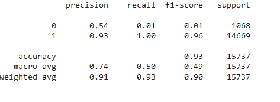
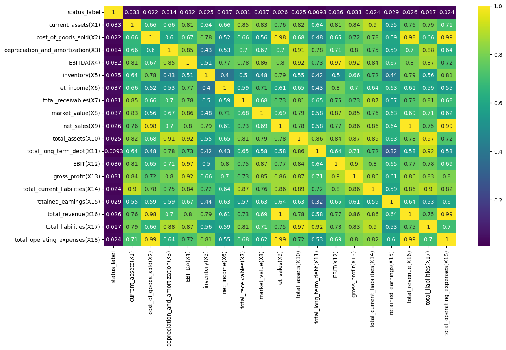
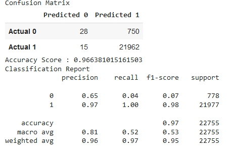
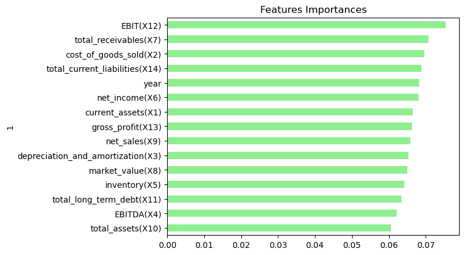
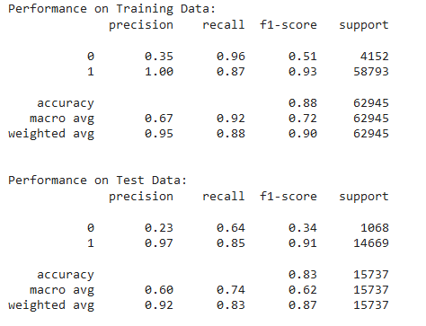

# predicting_non-bankrupt_companies

## Background

We discovered a dataset **american_bankruptct.csv** on Kaggle related to bankruptcy prediction for American public companies listed on the New York Stock Exchange and NASDAQ. The dataset includes accounting data from 8,262 companies collected between 1999 and 2018. We applied various machine learning models and deep neural networks to determine accuracy and precision. Additionally, we utilized Tableau for data visualization.

This is our main dataset : [(https://www.kaggle.com/datasets/utkarshx27/american-companies-bankruptcy-prediction-dataset/data)]

## Objective

We aimed to utilize this dataset to train our models to predict companies that would thrive without declaring bankruptcy and to discern the factors influencing a company's prolonged success.

## Team Members

- Jannatul Ferdos Hashi - Neural Network, PySpark SQL and Gradient Boosting

- Arun Balaram - Logistic Regression

- Sree Rama Pavan Vannemsetti - Random Forest and Feature Engineering

- Kangna Parekh - Tableau

## Project Work

### Neural Network and PySpark SQL

We initially used the **Neural Network** approach because of its capability to capture complex patterns and relationships in large datasets, making it a potentially powerful tool for predicting company strength based on various factors, and achieved an accuracy of **93.6%**

An initial glance might suggest our model's 93.6% accuracy is commendable. However, this figure mainly reflects the 93.6% of companies that didn't go bankrupt, while missing the crucial 6.4% that did. The pronounced accuracy is indicative of the inherent imbalance in our dataset, which predominantly represents non-bankrupt entities.

To navigate this imbalance, we experimented with various machine-learning approaches. Each comes with its own merits and limitations. Through comparative analysis, our objective is to enhance the breadth of our understanding and fortify prediction reliability.

Additionally, our analytical strategy integrates **PySpark SQL**, optimizing scalability and efficiency in data exploration. This ensures a deeper grasp of prevailing trends and nuances, offering insights that not only uphold the model's outputs but can also inform subsequent refinements.

## Different Machine Learning Models:

### Logistic Regression

We used **Logistic Regression** and below is our classification report for testing data:

**Analysis:**

**How well does the performance of the  training and test dataset compare?**

**Answer:** When it comes to Active companies, there is a 93% success rate, meanwhile for the failed companies there is only a 59% success rate. There is a lot of unpredictability within the "failed" companies. There could also be external factors as to why a company goes bankrupt.

**Confusion Matrix**

**TRUE NEGATIVE (34) FALSE POSITIVE (3910) FALSE NEGATIVE (29) TRUE POSITIVE (55038)**

The Confusion Matrix has 3910 false positive outcomes, meaning that there were 3910 companies that were thought to be alive, but actually went bankrupt. Due to the variables being all financial variables, and no external variables, this is the reason why the model may not have had small inaccuracies with the dataset.

**CLASSIFICATION REPORT OUTCOME FOR COMPANIES THAT ARE ALIVE**

ACCURACY = 93% PRECISION = 94% RECALL = 100% (1) F-1 SCORE = 97%

**Conclusion**

In terms of the logistic regression, due to the similarity of the X-variables (all Financial-Accounting related), even with a 93% success rate of companies that are alive, there will still be a small inaccuracy, as there are no external variables in the dataset. For this reason, there are limitations to the dataset, and it will not achieve full perfect accuracy.

For companies that are going bankrupt the success rate is only 53% and the recall is only 1 percent. The dataset timeline was from 1999 - 2018, where there were many external factors, that had a worldwide impact on companies. These are factors that cannot be seen, or even predicted.

### Random Forest

Then we used **Random Forest**. Random Forest offers a robust and generalized model by constructing multiple decision trees. We employed a **Heatmap** to discern feature collinearity..

We analyze that there is a lot of collinearity between the features, so we're applying feature engineering and reducing the features our classification report for testing data is shown below:

After that, we visualize the features by importance.

**Conclusion**

Using the Random Forest classification technique, a machine learning algorithm was built that would identify if the company remain without bankruptcy and must be targeted to enhance the market value and retained earning. Also, a multi-class classification was done to spot which features dominated the company's performance.

A company may need to enter bankruptcy due to poor market value, earnings, increase in liabilities, or long-term debt. This data analytic-based algorithm helps companies to predict their performance and keep them alive in the market.

Need some more features to provide more accurate information on the companies not to enter bankruptcy. Even though the accuracy is high, the model seems to be biased.

### Gradient Boosting

Following our insights from the Random Forest model, we identified potential performance enhancements. Hence, we turned to the Gradient Boosting model. The subsequent classification report sheds light on how this model fares in predicting company solvency. 

**Conclusion**

In this model, the training data exhibits a high accuracy of 88% and recall of 87% for companies that are not at risk (Class 1). This indicates the model's adeptness in pinpointing a significant majority of solvent companies during its training phase.

When tested on unseen data, the model still maintains robustness, securing an 83% accuracy rate and an 85% recall for non-risk companies. Such consistency between training and testing phases underlines the model's capability to generalize well, minimizing the likelihood of making false negative predictions—i.e., mistakenly labeling a solvent company as at risk.

Considering our project's prime focus, this model offers a dependable framework to accurately distinguish companies not at risk of bankruptcy, observing closely the set objectives and metrics set out in our goal.

### Limitations

**Imbalanced Dataset:** Our dataset predominantly consists of non-bankrupt companies, with only a few data points for bankrupt entities. This imbalance can skew the model's predictive capabilities.

**Insufficient Features:** The current set of input features might not be comprehensive enough. Relying exclusively on the provided financial metrics might miss out on other vital bankruptcy indicators. To predict more accurately, we need to gather additional data or metrics that can contribute to recognizing the non-bankrupt nature of companies.

**Sensitivity to Data Changes:** If there are significant economic shifts or changes in the industry, the model might need retraining or adjustments to stay relevant.

**Variables are all Financial-related (no external variables):** The model predominantly depends on financial indicators, excluding external or environmental variables that might play a significant role in a company's financial health. By not considering factors such as industry dynamics, geopolitical events, or managerial decisions, the model might miss out on potential insights that could be important in predicting a company's risk of bankruptcy more accurately.

### What are the advantages of this project:

**Data-Driven Decisions:** The project equips stakeholders with a data-driven approach to assess company health, allowing for informed decision-making instead of relying on intuition or broad market trends.

**Early Risk Detection:** Our model's high recall allows stakeholders to proactively identify companies at risk of bankruptcy well in advance, facilitating preventive measures and strategic decision-making.

**Benchmark Creation:** By utilizing multiple machine learning models, this project offers a comparative benchmark for bankruptcy prediction. Future models can be tested against these results for effectiveness.

**Continuous Improvement:** The identification of current limitations implies that there's a clear path for model refinement. As more data becomes available or new techniques are developed, the model can evolve.

**Broad Applicability:** The methodologies applied here can be adapted to other industries or geographies, making the approach versatile.

***Tableau URL:***
https://public.tableau.com/app/profile/kangna.parekh/viz/project4_16969880816240/SUCESSFAILUREstory

